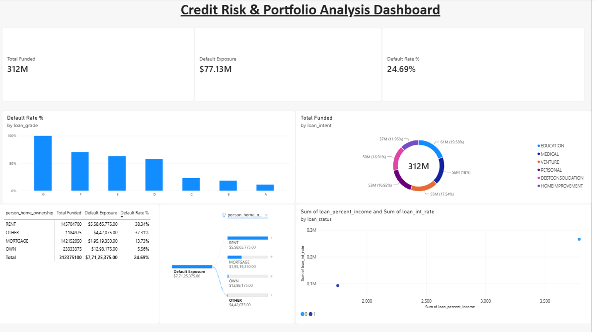

# Credit Risk & Portfolio Loss Analytics Engine



## 📌 Executive Summary
This project provides an end-to-end analytical framework to assess credit portfolio default exposure, evaluate borrower risk profiles, and quantify potential credit losses across **$312M in funded loans (32k+ historical records)**. 

By leveraging **Python**, **SQL (DuckDB)**, and **Power BI**, raw transaction records were cleaned, aggregated, and modeled into an interactive executive decision-support system.

---

## 🛠️ Tech Stack & Architecture
* **Database & SQL Engine:** DuckDB (CTEs, Window Functions, Aggregations)
* **Data Processing & EDA:** Python (`pandas`, `numpy`)
* **Business Intelligence & Visualization:** Power BI Desktop, DAX Measures
* **Data Flow Pipeline:**
  `Raw Kaggle Dataset (32k+ Records)` ──> `Python Data Cleaning` ──> `DuckDB SQL Transformations` ──> `Power BI DAX & Dashboards`

---

## 💡 Key Business Insights
1. **Housing Type Risk Exposure:** Renters represent **$145M+** of total portfolio exposure with the highest default rate (**38.3%**), compared to homeowners (**5.5%** default rate) and mortgage holders (**13.7%**).
2. **Grade-Based Risk Escalation:** Default rates scale dramatically from **Grade A loans (<10%)** to **Grade F/G loans (>70%)**, validating the necessity of risk-based pricing and strict loss provisioning.
3. **Capital Allocation & Loan Intent:** High-intent categories such as *Debt Consolidation* and *Medical* loans exhibit the highest risk profiles per funded dollar.

---

## 📊 Key DAX Measures Formulated
* **Total Funded ($):**
  ```dax
  Total Funded = SUM(cleaned_loan_data[loan_amnt])
